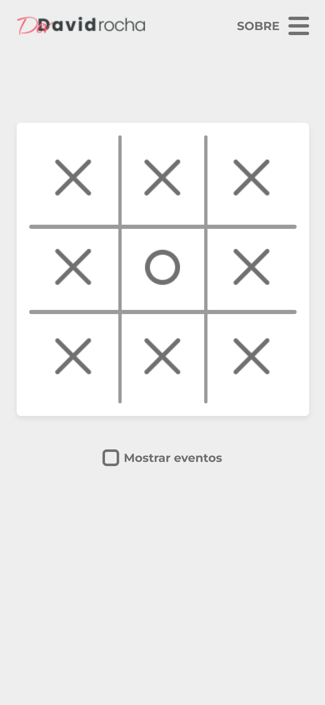
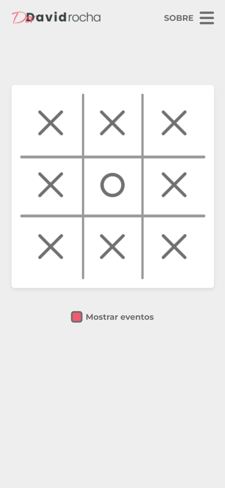

# Jogo da Velha (Tic Tac Toe)

 

This is my first React JS project. So i'm developing it while i study. 

## Sumary

- [Overview](#overview)
    - [The Challenge](#the-challenge)
- [My Process](#my-process)
    - [Built With](#built-with)
    - [What I Learned](#what-i-learned)
- [Screenshot](#screenshot)

## Overview

### The Challenge

Develop a Tic Tac Toe game and an 'About Me' responsive using React JS.

## My Process

### Built With

- React JS

### What I Learned

- What is Node
- What is React
- What is NPM
- What is Yarn
- Github Branch
- ITCSS (folder architecture)
  - Settings
  - Tools
  - Generic
  - Elements
  - Objects
  - Components
- Object 
- Component
- Fragment
- inline-flex
- inline-block
- Properties
- Text-ident
- RSCSS
- Theme variation

## Screenshot

  
  
  

The project is static yet!
